# Python 入门指南

作者：邢添珵

送给 *DUT* 的高同学!

## 前置知识

- **终端、PowerShell 和 cmd 是什么？他们有什么区别？**
  - 终端（*Computer terminal*），是一台电脑或者计算机系统，用来让用户输入数据，及显示其计算结果的机器，简而言之就是人类用户与计算机交互的设备。
  
  - *CMD* 是 *Windows* 命令处理器—— *Windows* 的命令行界面。它可以说是 `DOS` 的残留物。

  - *Windows PowerShell* 是一种基于 `.NET` 的脚本语言。你可以几乎把它当作*CMD* 的替代品来用，因为许多命令都有别名，可以转换为 *Windows PowerShell cmdlet*（例如，在 *PowerShell* 中输入 `'DIR'` 实际上会执行`'Get-ChildItem'` ，这是 *PowerShell* 的语法）。然而，它主要被设计成一种脚本语言，如果你需要自动化一些事情，这就是它的用武之地——它也有很多模块可以连接到其他系统，例如Active Directory、Exchange、365等等，所以它更倾向于管理员而不是家用。

  - *Windows Terminal* 本身什么也不是——它只是上面两者以及你系统上任何其他 `CLI` 或 `shell` 的前端应用程序。所以，你可以用一个标签页运行 *CMD* ，另一个标签页运行 *PowerShell* 。

- **IDE、IDLE、IDEA 是什么？有什么区别？**

  - **IDE**，集成开发环境，是用于提供程序开发环境的应用程序，一般包括代码编辑器、编译器、调试器和图形用户界面等工具。集成了代码编写功能、分析功能、编译功能、调试功能等一体化的开发软件服务套。
  - **IDLE**，是开发 *Python* 的基本 IDE，是安装 *Python* 自带的。
  - **IDEA**，是 *IntelliJ IDEA* 的简称，是一种 *Java* 语言开发的集成环境。

- **Anaconda 是什么？有什么用？**
  - *Anaconda* 是一个开源的 *Python* 和 *R* 语言的发行版本，用于计算科学（数据科学、机器学习、大数据处理和预测分析），*Anaconda* 致力于简化软件包管理系统和部署。*Anaconda* 透过 *Conda* 进行软件包管理，并拥有许多适用于 *Windows*、*Linux* 和 *MacOS* 的数据科学软件包。

- **环境变量是什么？为什么要配置它？**
  - 环境变量是一个动态命名的值，可以影响计算机上进程的行为方式。例如一个正在运行的进程可以查询TEMP环境变量的值，以发现一个合适的位置来存储临时文件，或者查询HOME或USERPROFILE变量，以找到运行该进程的用户所拥有的目录结构。

  - *Windows* 系统下，假如我们安装了某一款软件，安装结束后，在安装目录会生成一个该软件的 `.exe` 文件，双击该文件，我们就能启动软件。但是难道我们每次要运行该软件的时候都要先找到该 `.exe` 文件所在的路径，然后双击吗？显然是不可能的。因为安装的软件太多，我们根本不可能记住所有已安装软件的路径，同时如果我们在其他路径下想运行某些软件岂不是完蛋了。这时候就需要环境变量了。配置环境变量就是为了告诉操作系统，如何找到 *Python* 解释器，以及其它和 *Python* 相关的库和程序。比如 Path参数里存放的路径，就是为了告诉系统，当运行一个程序却没有完整路径时，除了可以在当前目录下寻找此程序，还可以在哪些目录下寻找。而配置环境变量，就是将程序的路径添加到环境变量的 Path参数里。比如配置 *Python* 的环境变量，就是将 *python.exe* 所在路径添加到 `Path` 中。这样一来，不管我们在哪个路径下运行 *Python*，就都可以成功运行了。

## 环境配置

### Python 下载与安装
如果你不需要重新装 *Python* ，请跳过这个部分。

*Python* 最新源码，二进制文档，新闻资讯等可以在 Python 的官网查看到：

[*Python* 官网](https://www.python.org/)

你可以在以下链接中下载 *Python* 的文档，你可以下载 HTML、PDF 和 PostScript 等格式的文档。

[Python文档下载地址](https://www.python.org/doc/)

打开 WEB 浏览器访问 https://www.python.org/downloads/windows/


在下载列表中选择 *Windows* 平台安装包，包格式为：python-XYZ.msi 文件 ， XYZ 为你要安装的版本号。
要使用安装程序 python-XYZ.msi, Windows 系统必须支持 Microsoft Installer 2.0 搭配使用。只要保存安装文件到本地计算机，然后运行它，看看你的机器支持 MSI。Windows XP 和更高版本已经有 MSI，很多老机器也可以安装 MSI。


下载后，双击下载包，进入 Python 安装向导，安装非常简单，你只需要使用默认的设置一直点击"下一步"直到安装完成即可。

### 环境变量配置

在环境变量中添加Python目录：

在命令提示框中(cmd) : 输入

```bash
path=%path%;C:\Python 
```
按下 `Enter`。

注意: `C:\Python` 是 *Python* 的安装目录。如果你把 *Python* 安装在别的地方，请把这里的 `C:\Python` 替换为你的安装目录。

也可以通过以下方式设置：

- 在下方搜索框输入“设置”，打开有齿轮图标的“设置”，在上方搜索框输入“查看高级系统设置”

- 点击右下方的“环境变量(N)...”

- 选择"系统变量"窗口下面的"Path",双击即可！

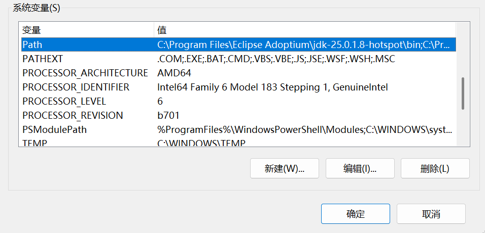

- 然后在"Path"行，点击右侧的“新建”，把你的 *Python* 安装路径复制进去。注意，复制的路径有两个，一个是根目录，比如：`D:\Program\Python\Python-38-32`，另一个路径是 `Scripts` ，比如：`D:\Program\Python\Python-38-32\Scripts\` ，复制完毕之后，点击"确定"便完成了环境变量的配置了

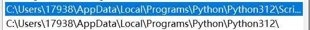

最后设置成功以后，在 *cmd* 命令行，输入命令 `python` ，就可以有相关显示。

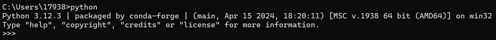

---

## IDE 使用

> IDE 是 Integrated Development Environment 的缩写，中文翻译为集成开发环境。它是一种用于软件开发的应用程序，将代码编辑、编译、调试、测试等功能集成到一个软件中，为开发人员提供了一个方便、统一的开发环境。

如果说原生的编辑器 (也就是你用的 *IDLE*) 是“毛坯房”，那么 *IDE* 工具就是“精装房”，*IDE* 软件为你提供好了各种家具（集成化的功能）和多样的装饰（外观）以及智能管家（代码拼写错误提示等工具）。

### Pycharm 的下载与使用

> PyCharm是由JetBrains公司开发的一款专为Python设计的IDE，拥有强大的智能提示、调试等特性，也有针对初学者友好的界面。

*Pycharm* 的优秀特性：

- **代码智能补全**： *PyCharm* 提供强大的代码智能补全功能，可以快速、准确地输入代码。

- **调试支持**： 内置强大的调试器，支持远程调试和本地调试。你可以逐行执行代码，查看变量的值，以便更好地定位和解决问题。

- **版本控制**： 支持常见的版本控制系统，如 *Git*、*Mercurial* 等，可以方便地进行版本控制和协同开发。
- **自动化测试**： 内置的测试工具支持自动化测试，方便进行单元测试和集成测试。
Web开发支持： *PyCharm* 不仅支持 *Python* 开发，还对Web开发提供了良好的支持，包括 *HTML*、*CSS*、*JavaScript* 等。


#### 下载

前往 *PyCharm* 官网下载 Community 版本（免费版）：https://www.jetbrains.com/pycharm/download/?section=windows

如果进去页面是英文，可以点击页面右上角更改语言。


直接点击 `Download` 下载安装即可。

如果你需要专业版的Pycharm，可以免费获取专业版许可证。

教育优惠认证：
https://www.jetbrains.com/zh-cn/academy/student-pack/#students/

#### 安装

直接运行下载后的安装程序（就是那个 `.exe` ），按照向导指示进行安装。

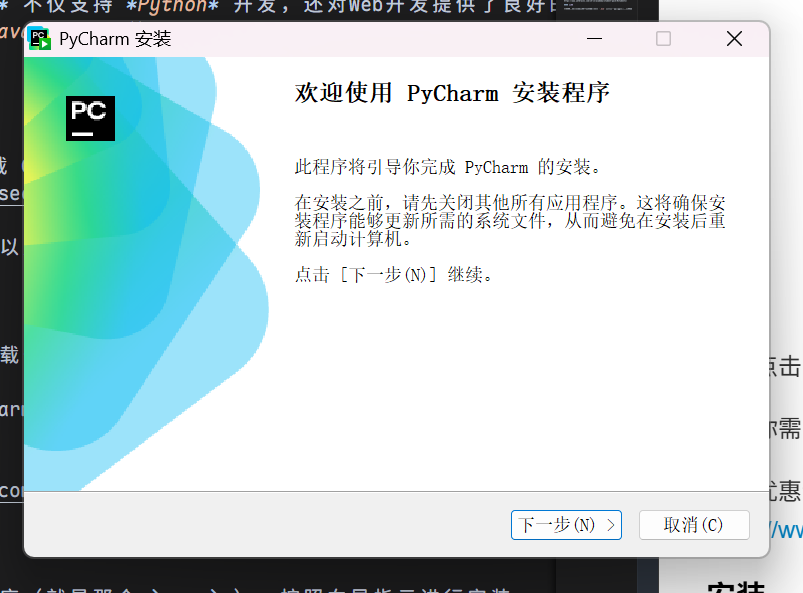

- 选择安装目录，建议你安装到 `D` 盘，比如新建一个 `Pycharm` 文件夹。

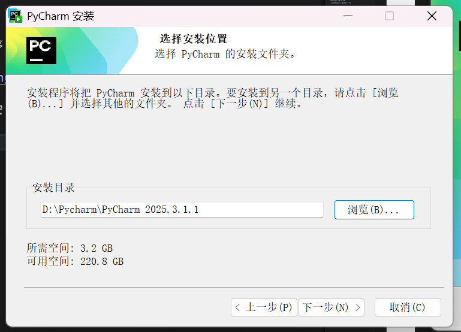

- 都可以选上，点击下一步

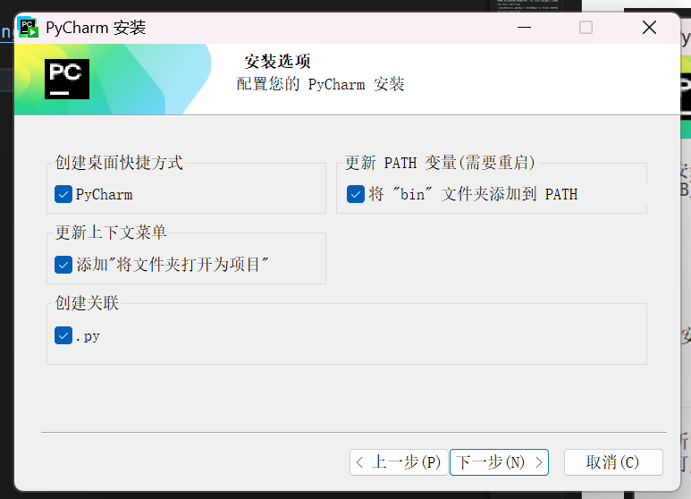

- 点击安装，等待安装完成即可

#### 新建项目

- 首次启动时，记得勾选用户协议，然后继续

- 如果有个导入设置，你跳过就行（因为你没用过 vscode）

- 如果你已经有要打开的目标文件夹，点击左上角三条横杠，点击打开，选择文件夹即可。这里建议你在 `D` 盘建好文件夹再打开。

- 点击加号新建项目，你目前用得到的基本上只有前两项：*Python* 文件和 *Jupter Notebook*


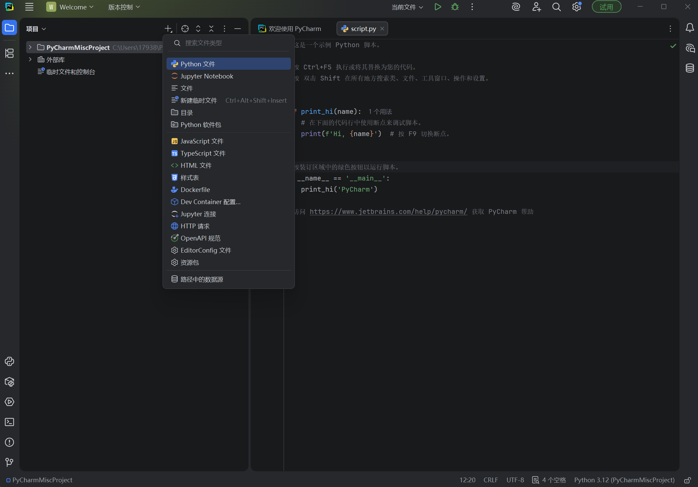

- 新建一个 `.py` 文件，就可以开始写了。更复杂的部分以后再探索吧!

> 由于我选择的是从我的 `vscode` 导入，所以我不太清楚第一次打开会怎么样。
下面给出一些你可能需要的教学

在打开项目时，你可能需要配置项目的各项参数。我们依次配置项目文件夹的名称，存放位置，是否创建 *Git* 和欢迎文件。如果你已经成功安装了 *Python* ，点击 *Python version* 那栏的下拉框会自动检测到本机安装的 *Python* 版本和安装位置。

例如我的 *Python* 版本是 *3.12* ，位置在 `D:\Enverioments\Python3.12` 中，我们选择即可。

#### 设置 Python 解释器

> 解释器（*interpreter*），是一种计算机程序，能够把解释型语言解释执行。解释器就像一位“中间人”。解释器边解释边执行，因此依赖于解释器的程序运行速度比较缓慢。解释器的好处是它不需要重新编译整个程序，从而减轻了每次程序更新后编译的负担。相对的编译器一次性将所有源代码编译成二进制文件，执行时无需依赖编译器或其他额外的程序。
> 当我们编写Python代码时，我们得到的是一个包含Python代码的以.py为扩展名的文本文件。要运行代码，就需要Python解释器去执行.py文件。
>由于整个Python语言从规范到解释器都是开源的，所以理论上，只要水平够高，任何人都可以编写Python解释器来执行Python代码（当然难度很大）。事实上，确实存在多种Python解释器。
>当我们从Python官方网站下载并安装好Python 3.x后，我们就直接获得了一个官方版本的解释器：CPython。这个解释器是用C语言开发的，所以叫CPython。在命令行下运行python就是启动CPython解释器。
>CPython是使用最广的Python解释器。教程的所有代码也都在CPython下执行。

依旧点击左上角的三条杠，在弹出的框中选择“设置”，找到“Python”,点击“解释器”，然后选择你需要的解释器即可（比如我这里是 `Python 3.12`）。如果你发现这里没有任何东西，请联系本文作者xtc解决。

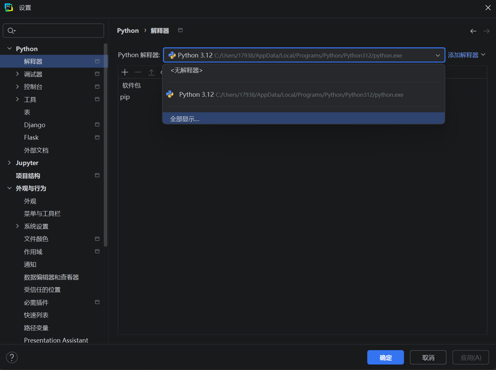

当然，还有第二种方式，就是在右下角点击，直接选择解释器，如图所示：

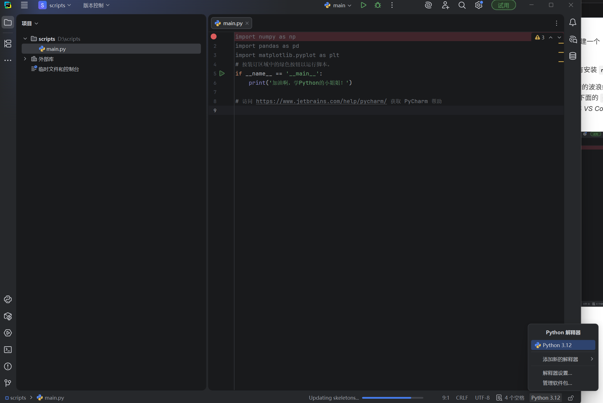

#### 开始在 Pycharm 的第一个程序

在刚刚打开的文件夹中，如果文件夹是空的，*Pycharm* 应该会为你新建一个 `main.py`，你可以随便在里面写点什么。

比如我希望通过 `import numpy as np` 导入 `numpy`，结果发现，我没有安装 `numpy`。

于是 *Pycharm* 的超级优点就体现出来了！你可以直接把鼠标停在报错的波浪线下方（就是没有安装的 `numpy` 下面），然后你会惊喜地发现，你可以点击下面的 `安装软件包 numpy` 来直接安装 `numpy` !这也是为什么我劝你使用 *Pycharm* 而非 *VS Code* 的原因之一。

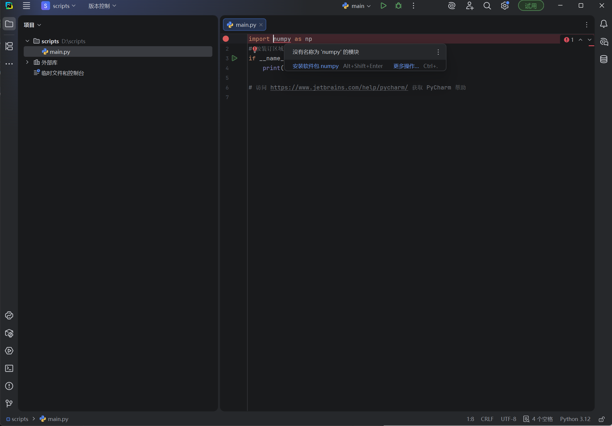

稍微等待一会，在下方的进度条满了之后，就安装好了。是不是非常方便呢？

比如我们写一个测试 `numpy` 和 `pandas` 的简单脚本：

```python
import numpy as np
import pandas as pd

a = np.array([1, 2, 3, 4, 5])
b = np.arange(1, 6)

print("a:", a)
print("b:", b)

print("a + b =", a + b)
print("a * 2 =", a * 2)
print("mean(a) =", a.mean())
print("std(a) =", a.std())

# 矩阵运算
A = np.array([[1, 2], [3, 4]])
B = np.array([[5, 6], [7, 8]])
print("A @ B =\n", A @ B)

df = pd.DataFrame({
    "name": ["Alice", "Bob", "Charlie"],
    "math": [85, 90, 78],
    "cs": [92, 88, 95]
})

print(df)

print("\nAverage scores:")
print(df[["math", "cs"]].mean())

print("\nAdd total score column:")
df["total"] = df["math"] + df["cs"]
print(df)

print("\nFilter students with total >= 180:")
print(df[df["total"] >= 180])

print("\nDescribe:")
print(df.describe())
```

直接点击正上方的绿色三角形（就在你的文件名的右侧，那个看起来像瓢虫的图标的左侧）或者使用快捷键 `Ctrl+Shift+U` 就可以运行了！结果会出现在下方。

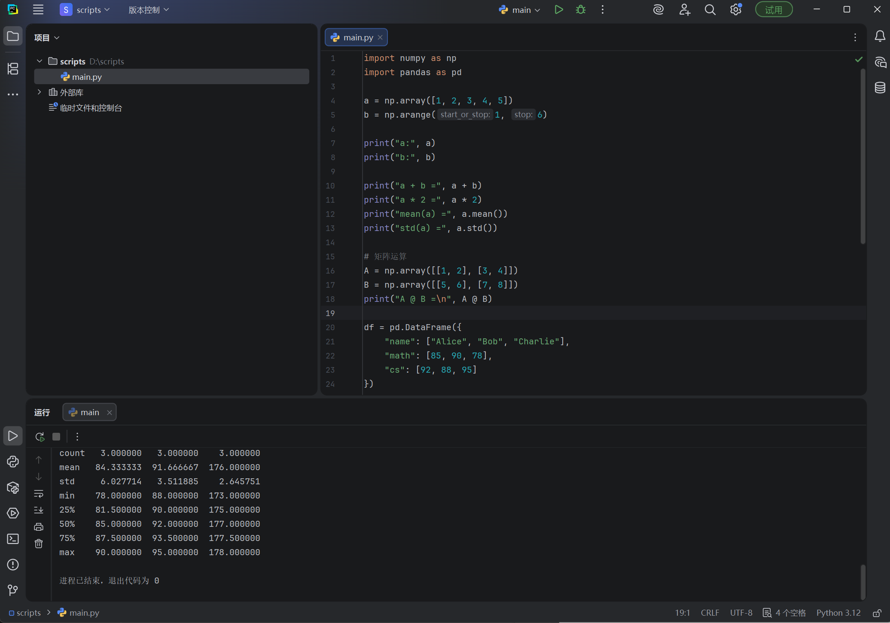

得到测试结果：

```bash
a: [1 2 3 4 5]
b: [1 2 3 4 5]
a + b = [ 2  4  6  8 10]
a * 2 = [ 2  4  6  8 10]
mean(a) = 3.0
std(a) = 1.4142135623730951
A @ B =
 [[19 22]
 [43 50]]
      name  math  cs
0    Alice    85  92
1      Bob    90  88
2  Charlie    78  95

Average scores:
math    84.333333
cs      91.666667
dtype: float64

Add total score column:
      name  math  cs  total
0    Alice    85  92    177
1      Bob    90  88    178
2  Charlie    78  95    173

Filter students with total >= 180:
Empty DataFrame
Columns: [name, math, cs, total]
Index: []

Describe:
            math         cs       total
count   3.000000   3.000000    3.000000
mean   84.333333  91.666667  176.000000
std     6.027714   3.511885    2.645751
min    78.000000  88.000000  173.000000
25%    81.500000  90.000000  175.000000
50%    85.000000  92.000000  177.000000
75%    87.500000  93.500000  177.500000
max    90.000000  95.000000  178.000000
```

到这里，就已经基本上可以了！更多入门操作可以参考：https://www.runoob.com/pycharm/pycharm-tutorial.html

--- 

## Numpy 与 Pandas 入门

### Numpy 介绍

> NumPy(Numerical Python) 是 Python 语言的一个扩展程序库，支持大量的维度数组与矩阵运算，此外也针对数组运算提供大量的数学函数库。
> NumPy 的前身 Numeric 最早是由 Jim Hugunin 与其它协作者共同开发，2005 年，Travis Oliphant 在 Numeric 中结合了另一个同性质的程序库 Numarray 的特色，并加入了其它扩展而开发了 NumPy。NumPy 为开放源代码并且由许多协作者共同维护开发。


### NumPy 基础

在使用 NumPy 之前，习惯性的标准导入方式是：

```python
import numpy as np
```

#### 数组的创建 

NumPy 的核心是 N 维数组对象（`ndarray`）。不同于 Python 的列表（List），NumPy 数组要求所有元素类型相同，这使得它在内存中更加紧凑，计算速度更快。

* **从列表创建：** 使用 `np.array()` 将普通列表转换为数组。
```python
arr = np.array([1, 2, 3, 4, 5])
# 指定数据类型
arr_float = np.array([1, 2, 3], dtype=np.float32)
```


* **创建特定占位数组：** 初始化全 0、全 1 或随机数组，常用于机器学习参数初始化。
```python
np.zeros((3, 4))        # 创建 3x4 的全 0 数组
np.ones((2, 3))         # 创建 2x3 的全 1 数组
np.full((2, 2), 7)      # 创建 2x2 的全 7 数组
np.eye(3)               # 创建 3x3 的单位矩阵
```


* **创建序列：**
```python
np.arange(0, 10, 2)     # 类似 range()，结果为 [0, 2, 4, 6, 8]
np.linspace(0, 1, 5)    # 在 0 到 1 之间均匀生成 5 个数（包含端点）
```


* **生成随机数：**
```python
np.random.rand(3, 2)    # 生成 [0, 1) 之间的均匀分布随机数
np.random.randn(3, 2)   # 生成标准正态分布随机数 (均值0, 方差1)
np.random.randint(0, 10, (2, 2)) # 生成 [0, 10) 之间的随机整数
```


#### 数组的属性 

了解数组的“身体状况”是处理数据的第一步。

* `arr.ndim`: 数组的维度（秩），例如一维数组为 1，二维矩阵为 2。
* `arr.shape`: 数组的形状，返回一个元组。例如 `(3, 4)` 表示 3 行 4 列。
* `arr.size`: 数组中元素的总个数。
* `arr.dtype`: 数组中元素的数据类型（如 `int64`, `float32`）。

#### 索引与切片 

NumPy 的切片操作非常强大，且通常返回的是**视图**而非副本，这意味着修改切片会影响原数组。

* **基础切片：** 语法与 Python 列表类似 `[start:stop:step]`。
```python
arr = np.arange(10)
print(arr[2:5])        # 输出 [2 3 4]
print(arr[: : -1])     # 倒序输出
```


* **多维数组索引：** 使用逗号分隔维度。
```python
arr2d = np.array([[1, 2, 3], [4, 5, 6], [7, 8, 9]])
print(arr2d[1, 2])     # 第 1 行，第 2 列的元素（输出 6）
print(arr2d[0:2, 1:])  # 前两行，从第 1 列开始的所有列

```


* **布尔索引：** 非常重要的功能，用于筛选数据。
```python
arr = np.array([1, 2, 3, 4, 5])
mask = arr > 3         # 生成布尔数组 [False, False, False, True, True]
print(arr[mask])       # 筛选出大于 3 的元素：[4 5]
# 一行写完：
print(arr[arr % 2 == 0]) # 筛选出所有偶数
```


#### 形状操作 

在深度学习和数据预处理中，经常需要改变数组的形状。

* **改变形状：** `reshape` 是最常用的方法。
```python
arr = np.arange(12)
new_arr = arr.reshape(3, 4) # 变成 3 行 4 列，元素总数必须一致
```


> **注意**：`reshape` 中的参数若为 `-1`，表示该维度自动计算。例如 `arr.reshape(3, -1)` 会自动算出列数为 4。


* **扁平化：** 将多维数组降为一维。
```python
arr.ravel()   # 返回视图
arr.flatten() # 返回副本（占用新内存）
```


* **转置：** 矩阵的行列互换。
```python
arr.T
# 或
arr.transpose()
```


#### 数学运算与广播

NumPy 的运算默认是**元素级（Element-wise）**的，这是它与普通线性代数库的一个区别。

* **基本运算：**
```python
x = np.array([1, 2])
y = np.array([3, 4])
print(x + y)    # [4 6]
print(x * y)    # [3 8]  这是对应位置相乘，也就是所谓的哈达玛乘积，不是矩阵乘法！
```


* **矩阵乘法：** 使用 `@` 运算符或 `dot` 函数。
```python
print(x @ y)       # 点积，输出 11 (1*3 + 2*4)
# 或 np.dot(x, y)
```


* **聚合函数：**
通常需要指定 `axis`（轴）。`axis=0` 代表沿着“第一个维度”（通常是列/垂直方向）操作，`axis=1` 代表沿着“第二个维度”（通常是行/水平方向）操作。
```python
arr = np.array([[1, 2], [3, 4]])
print(arr.sum())          # 所有元素之和：10
print(arr.sum(axis=0))    # 也就是按列求和：[4 6]
print(arr.max(axis=1))    # 按行求最大值：[2 4]
```


* **广播机制：**
这是 NumPy 最强大的特性之一。当两个数组形状不同时，NumPy 会尝试自动扩展较小的数组以匹配较大的数组，从而进行数学运算。
```python
A = np.array([[1, 2, 3], [4, 5, 6]]) # 形状 (2, 3)
B = np.array([10, 20, 30])           # 形状 (3,)

# B 会被自动“广播”成 [[10, 20, 30], [10, 20, 30]] 
print(A + B) 
# 结果：
# [[11 22 33]
#  [14 25 36]]
```

#### 线性代数

虽然简单的加减乘除是元素级的，但在科学计算中，我们经常需要进行矩阵乘法、求逆、求特征值等操作。NumPy 将大部分高级线性代数功能封装在 `numpy.linalg` 模块中。

**矩阵乘法**

这是初学者最容易混淆的地方：区分**逐元素乘法**和**矩阵点积**。

* **逐元素乘法 (`*`)**: 对应位置相乘。
* **矩阵乘法 (`@` 或 `np.dot`)**: 遵循线性代数规则（行乘列求和）。

```python
A = np.array([[1, 2], 
              [3, 4]])
B = np.array([[5, 6], 
              [7, 8]])

# 1. 逐元素相乘 (Element-wise product)
print(A * B)
# 结果: [[ 5 12]
#       [21 32]]

# 2. 矩阵乘法 (Dot product)
# 推荐使用 @ 运算符 (Python 3.5+ 支持)
print(A @ B)
# 结果: [[19 22]   <-- (1*5 + 2*7), (1*6 + 2*8)
#       [43 50]]

# 兼容旧代码的写法
print(np.dot(A, B)) 
```

**常用矩阵属性与运算**

处理方阵时，经常需要计算其行列式、逆矩阵或迹。

```python
import numpy.linalg as lg

arr = np.array([[1, 2], [3, 4]])

# 1. 转置 (Transpose)
print(arr.T)

# 2. 逆矩阵 (Inverse)
# 注意：如果矩阵不可逆 (Singular Matrix)，会抛出 LinAlgError
inv_arr = lg.inv(arr)
print(inv_arr)
# 验证：原矩阵 @ 逆矩阵 应该等于单位矩阵
# np.allclose 用于比较浮点数是否足够接近（忽略微小误差）
print(np.allclose(arr @ inv_arr, np.eye(2)))  # True

# 3. 行列式 (Determinant)
det_val = lg.det(arr)
print(det_val) # -2.0000...

# 4. 矩阵的迹 (Trace) - 对角线元素之和
print(np.trace(arr)) # 1 + 4 = 5
```

**求解线性方程组**

这是工程中最常见的应用之一。假设我们要解方程组 ：

写成矩阵形式即：

```python
A = np.array([[1, 2], [3, 5]])
b = np.array([10, 20])

# 使用 solve 函数求解
x = lg.solve(A, b)

print(x) 
# 输出 [-10.  10.]  即 x=-10, y=10
```

> **提示**：虽然 `x = inv(A) @ b` 也能算出结果，但在数值计算中，推荐始终使用 `solve`，因为它比求逆矩阵更快且数值稳定性更高。

**特征值与特征向量**

在降维算法（如 PCA）和物理模拟中非常关键。

```python
A = np.array([[4, -2], 
              [1,  1]])

# eig 函数同时返回特征值 (eigenvalues) 和特征向量 (eigenvectors)
eigenvalues, eigenvectors = lg.eig(A)

print("特征值:", eigenvalues)
print("特征向量:\n", eigenvectors)
```

**范数**

在机器学习的正则化中，经常需要计算向量的长度（L1 或 L2 范数）。

```python
v = np.array([3, 4])

# 默认计算 L2 范数 (欧几里得距离) -> sqrt(3^2 + 4^2) = 5
l2 = lg.norm(v) 
print(l2) # 5.0

# 计算 L1 范数 (绝对值之和) -> |3| + |4| = 7
l1 = lg.norm(v, ord=1)
print(l1) # 7.0

```
---

### Pandas 入门

#### Pandas 介绍

> Pandas 是基于 NumPy 构建的，让以 NumPy 为中心的应用变得更加简单。它提供了高效地操作大型数据集所需的工具。Pandas 的名称来自于“Panel Data”（面板数据）和“Python Data Analysis”（Python 数据分析）。
> 它的核心在于提供了两个极其强大的数据结构：**Series**（一维数据）和 **DataFrame**（二维表格数据）。

习惯性的标准导入方式：

```python
import pandas as pd
```

#### 核心数据结构

理解 Pandas，首先要理解它的两种基本“容器”。

* **Series (一维序列):** 带标签的一维数组。你可以把它看作是一个定长的有序字典，或者 Excel 中的某一列。
```python
# 创建 Series
s = pd.Series([1, 3, 5, np.nan, 6, 8])
print(s)
# 输出包含索引(0,1,2...)和数据类型(float64等)
```


* **DataFrame (二维数据表):** 表格型数据结构。它含有一组有序的列，每列可以是不同的值类型（数值、字符串、布尔值等）。它既有行索引（index），也有列索引（columns）。

#### 数据的创建与读取 

在实际工作中，我们很少手写大数据，通常是从文件读取（CSV, Excel, SQL），但手写小规模数据用于测试非常重要。

* **通过字典创建 DataFrame:** 这是最直观的方法。
```python
data = {
    'Name': ['Alice', 'Bob', 'Charlie', 'David'],
    'Age': [24, 27, 22, 32],
    'City': ['New York', 'Los Angeles', 'Chicago', 'Houston']
}
df = pd.DataFrame(data)
print(df)
```


* **读取外部文件:** Pandas 的 I/O 功能非常强大。
```python
# df = pd.read_csv('data.csv')      # 读取 CSV
# df = pd.read_excel('data.xlsx')   # 读取 Excel
```


#### 查看数据

拿到数据的第一步，通常是先“看一眼”数据的全貌。

* **查看头部和尾部:**
```python
df.head()    # 默认显示前 5 行
df.tail(3)   # 显示后 3 行
```


* **查看摘要信息 (非常重要):**
```python
df.info()    
# 输出：行数、列数、每列的数据类型、内存占用、以及非空(non-null)值的数量。
# 這是检查数据缺失最快的方法。
```


* **统计性描述:**
```python
df.describe() 
# 快速计算数值列的统计量：计数、均值、标准差、最小值、四分位数、最大值。
```


#### 数据的选择与索引

这是 Pandas 中最容易混淆的部分。请记住两个核心属性：`.loc` (基于标签) 和 `.iloc` (基于位置)。

* **选择单列:** 返回一个 Series。
```python
df['Name']       # 推荐写法
# 或 df.Name     # 属性写法（列名无空格时可用）
```


* **基于标签选择 (`.loc`):** “你看得见什么就选什么”。
```python
# 选择索引为 0 的行（这里索引恰好是数字0）
print(df.loc[0]) 

# 选择所有行的 'Name' 和 'City' 列
print(df.loc[:, ['Name', 'City']]) 
```


* **基于位置选择 (`.iloc`):** 纯粹基于整数下标，用法类似 NumPy。
```python
print(df.iloc[3])       # 第 4 行的数据
print(df.iloc[1:3, 0:2]) # 第 2~3 行，第 1~2 列的数据
```


* **布尔索引:** 类似 NumPy，用于数据筛选。
```python
# 筛选年龄大于 25 的人
print(df[df['Age'] > 25])

# 组合条件（注意要用括号，并使用 & 和 |）
print(df[(df['Age'] > 25) & (df['City'] == 'New York')])
```


#### 数据清洗

真实世界的数据通常是“脏”的，处理缺失值（Missing Data）是 Pandas 的强项。

* **检查缺失值:**
```python
df.isnull()         # 返回布尔 DataFrame
df.isnull().sum()   # 统计每列有多少个缺失值
```


* **处理缺失值:**
```python
# 1. 删除包含缺失值的行
df.dropna(how='any') 

# 2. 填充缺失值 (例如用平均值填充)
df.fillna(value=0)
# 或
df['Age'].fillna(df['Age'].mean())
```


#### 统计与分组 

类似于 *SQL* 中的 `GROUP BY`，这用于挖掘数据特征。

* **基本统计:**
```python
df.mean()      # 计算每列均值
df.corr()      # 计算列之间的相关系数矩阵
df['City'].value_counts() # 统计某列中每个唯一值出现的次数（非常常用）
```


* **分组 (`groupby`):**
```python
# 假设我们加一列 'Department'
df['Department'] = ['HR', 'IT', 'HR', 'IT']

# 按部门分组，并计算平均年龄
print(df.groupby('Department')['Age'].mean())
# 结果：
# Department
# HR    23.0
# IT    29.5
# Name: Age, dtype: float64
```


#### 数据输出

处理完数据后，保存结果。

```python
# index=False 表示不把行索引（0,1,2...）写入文件
df.to_csv('output.csv', index=False)
```

